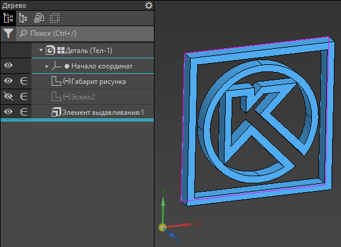

# KompasAPI-01
Библиотека-обёртка для API САПР «Компас-3D», включающая stub-файлы с аннотациями типов и документацией из Справки SDK.

Stub-файлы — ключевое преимущество библиотеки — содержат аннотации типов и тем самым позволяют ускорить написание кода благодаря автодополнению в среде разработки (IDE) и описаниям из Справки SDK Компас, встроенным в docstrings:


Stub-файлы модулей API Компас были сгенерированы автоматически — при этом удалось извлечь полезную информацию из 610 MB страниц Справки SDK и уложить её всего в 10 MB — с помощью программы [KompasAPI-stubs-generator](https://github.com/nikitamamay/KompasAPI-stubs-generator).

Библиотека создана на основе модулей API Компас-3D версии v22, но может быть использована как для более поздних версий, так и для более ранних. При этом на ранних версиях Компас-3D при выполнении скриптов с обращением к недоступным функциям API будут выходить ошибки во время исполнения кода.

Работоспособность библиотеки проверена на Python 3.11 и Компас-3D v22 учебной версии.

# Установка

Библиотека предназначена для работы на актуальной версии Python, который глобально установлен на компьютере. Не требуется и не рекомендуется использовать Python, который поставляется вместе с Компас-3D, так как он устаревшей версии.

Установить библиотеку с помощью команды:
```
pip install git+https://github.com/nikitamamay/KompasAPI-01
```

> **Примечание.** При скачивании и установке пакета с GitHub через `pip` требуется, чтобы на компьютере был установлен [git](https://git-scm.com/install/windows).


# Примеры кода

Примеры представлены в пакете `examples`. Некоторые из них:

1. Макрос, демонстрирующий работу с эскизами и создание операции вытягивания
    на примере рисования логотипа Компас-3D из SVG-файла.

    Для работы скрипта требуется библиотека `svg.path`. Её можно установить с помощью команды `pip install svg.path`.
    ```
    python -m KompasAPI_01.examples.extrude_svg [-h] [-s SVG] [-o OUTPUT]
    ```
    

2. Макрос для обновления положения точки, которая должна быть расположена в центре масс модели.
    ```
    python -m KompasAPI_01.examples.rebuild_cg_point [-h] [-p POINT]
    ```

3. Пример, демонстрирующий работу функции `core.isinstance_for_KompasAPI()`.

    Для работы следует открыть 3D-модель, в которой должны быть плоскости, построенные
    произвольным образом (командами "Смещенная плоскость", "Плоскость через 3 точки",
    "Плоскость под углом" и/или др.).
    При запуске скрипта будут найдены объекты всех плоскостей, так как классы этих объектов
    наследуются от класса `KompasAPI7.IPlane3D` и тем самым проходят проверку
    функцией `core.isinstance_for_KompasAPI(obj, KompasAPI7.IPlane3D)`. [Подробнее об иерархии классов...](https://github.com/nikitamamay/KompasAPI-stubs-generator?tab=readme-ov-file#%D0%B8%D0%B5%D1%80%D0%B0%D1%80%D1%85%D0%B8%D1%8F-%D0%BA%D0%BB%D0%B0%D1%81%D1%81%D0%BE%D0%B2)
    ```
    python -m KompasAPI_01.examples.test_isinstance
    ```


# Состав библиотеки

Состав пакета `KompasAPI-01`:
* модуль `core` с основными функциями для работы с Компас API;
* модуль `extras` с дополнительными функциями;
* модуль `is_instance`, реализующий функцию `isinstance_for_KompasAPI()` для иерархии классов Компас API;
* модули `Kompas6API5` и `KompasAPI7` с интерфейсами API Компас-3D версий 5 и 7 соответственно (реализуют импорт модуля с помощью `win32com.client.gencache.gencache.EnsureModule()`);
* stub-файлы для модулей `Kompas6API5` и `KompasAPI7` с аннотациями типов, корректным перечнем свойств классов и документацией к каждому классу, методу, свойству из Справки SDK Компас;
* модуль `constants` с константами и перечислениями API Компас-3D;
* модуль `classes_hierarchy` с информацией о наследовании классов API друг от друга.


